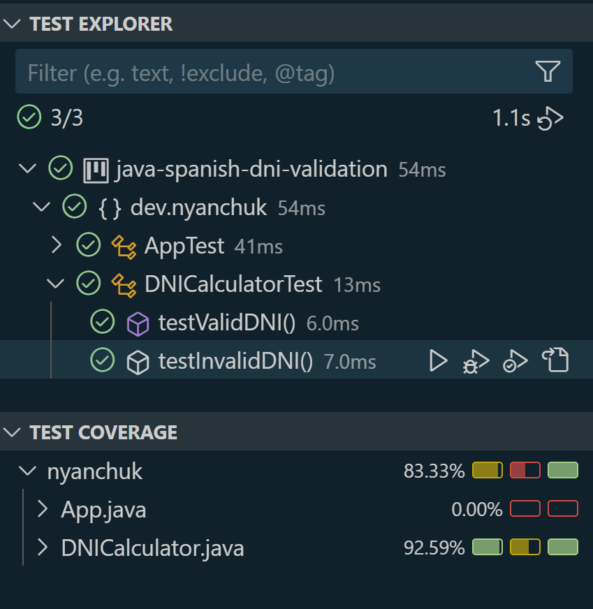

# Spanish DNI Validation

This is a simple Java application for validating Spanish DNI (National Identity Number) and calculating the corresponding letter. The program checks if the DNI number is valid and returns the correct letter according to the Spanish DNI letter calculation rules.

## Formula to calculate the letter of the DNI
Take the complete 8-digit number of the DNI, divide it by 23, and keep the remainder of the division, or in other words, calculate the modulo 23 of the DNI.

The result is a number between 0 and 22. Each of these numbers corresponds to a letter, according to the following table:

| REMAINDER | 0   | 1   | 2   | 3   | 4   | 5   | 6   | 7   | 8   | 9   | 10  | 11  | 12  | 13  | 14  | 15  | 16  | 17  | 18  | 19  | 20  | 21  | 22  |
|-----------|-----|-----|-----|-----|-----|-----|-----|-----|-----|-----|-----|-----|-----|-----|-----|-----|-----|-----|-----|-----|-----|-----|-----|
| LETTER    | T   | R   | W   | A   | G   | M   | Y   | F   | P   | D   | X   | B   | N   | J   | Z   | S   | Q   | V   | H   | L   | C   | K   | E   |

## Features

- **DNI Validation**: Validates if the input is a valid 8-digit number.
- **Letter Calculation**: Calculates the corresponding letter for a given DNI number using modulo 23.
- **Error Handling**: Displays appropriate error messages when the input is invalid.

## Project Setup

### Prerequisites

- Java 8 or higher
- Maven for project management and testing

### Installation

1. Clone this repository to your local machine:

    ```
    git clone https://github.com/NelliYanchuk/java-spanish-dni-validation.git
    ```

2. Navigate to the project directory:

    ```
    cd java-spanish-dni-validation
    ```

3. Build the project using Maven:

    ```
    mvn clean install
    ```

### Running the Application

1. To run the application, use the following command:

    ```
    mvn exec:java
    ```

2. The program will prompt you to enter an 8-digit DNI number. It will validate the input and display the corresponding letter.

### Example Output:

    Please enter the 8-digit DNI number: 12345678
    The letter corresponding to the DNI number 12345678 is: Z

## Testing

The project uses **JUnit 5** for unit tests.

### Running Tests

To run the tests, use the following Maven command:

    mvn test

### Tests Included

- **Valid DNI tests**: Validates correct DNI numbers and calculates the corresponding letter.
- **Invalid DNI tests**: Tests cases for invalid inputs (less than 8 digits, more than 8 digits, or non-numeric characters).
- **Main method tests**: Simulates input and captures output to verify the program prints the correct messages for both valid and invalid inputs.

## Test Coverage



## Author
**Nelli Yanchuk** - Developer

Contact me with: [GitHub](https://github.com/NelliYanchuk) / [LinkedIn](https://www.linkedin.com/in/nelli-yanchuk-a24b81138/)
